# FLUANZ — C4 Level 2: Container Architecture

## Purpose

This document decomposes the single FLUANZ system established in the C4 Level 1 System Context into its runtime containers. A container, per Simon Brown's C4 methodology, is a separately runnable/deployable unit — not a component, not a class, not an API, and not a database schema. This document identifies those units, their responsibilities, how they communicate, and the trust boundaries between them.

This is a structural document. It does not describe internal components, API contracts, or database schemas. Database and persistence concerns are acknowledged only as an infrastructure container, per the constraints of this artifact.

---

# 1. Containers Overview

FLUANZ is composed of ten runtime containers, organized into four categories:

| Category | Containers |
|---|---|
| **Experience Containers** (how actors reach FLUANZ) | Marketing Website, Customer Workspace, Concierge Workspace |
| **Platform Entry & Product Execution** | API Gateway, Assessment Runtime |
| **Shared Platform Capabilities** | Intelligence Platform, Integration Platform, Reporting Platform, Platform Services |
| **Infrastructure** | Infrastructure Services |

This categorization is a direct container-level expression of Architecture Vision v1.0's distinction between platform-owned capability and product-family-owned interpretation of that capability (Section 3, Platform Responsibilities).

---

# 2. Container Definitions and Responsibilities

## Marketing Website
**Category:** Experience Container
**Responsibility:** The public, unauthenticated presentation surface of FLUANZ. Communicates product positioning and captures initial visitor intent (e.g., starting an assessment). Holds no commercial intelligence, no tenant data, and no reasoning logic.
**Belongs to:** Neither shared platform nor product execution — a pre-platform entry surface.

## Customer Workspace
**Category:** Experience Container
**Responsibility:** The authenticated surface through which the Executive Revenue Leader and Operational Revenue User interact with FLUANZ — initiating assessments, viewing readiness intelligence, receiving alerts and recommendations, and exercising final authority over any recommended action. Renders intelligence; it does not generate it.
**Belongs to:** Product execution surface (consumer-facing), backed entirely by shared platform capability.

## Concierge Workspace
**Category:** Experience Container
**Responsibility:** The authenticated surface through which the Concierge Expert performs manual verification, executive review, and validation of AI-generated intelligence before it is treated as authoritative. This container is the structural home of the Concierge Guardrail.
**Belongs to:** Product execution surface (internal-facing), backed entirely by shared platform capability.

## API Gateway
**Category:** Shared Platform Capability
**Responsibility:** The single, mandatory entry point for all authenticated traffic into FLUANZ's internal containers. Enforces that every request carries verified identity and organizational context before routing it onward. No experience container may reach any internal container except through the API Gateway.
**Belongs to:** Shared platform capability.

## Assessment Runtime
**Category:** Product Execution
**Responsibility:** Executes structured commercial evaluation workflows — the runtime home of Assess™ today, architected to extend to Monitor™ and Activate™ execution as the platform evolves (Engineering Principle 16, Evolution Without Rewrite). Orchestrates the lifecycle of an assessment or signal-driven workflow, but performs no independent reasoning of its own — all commercial reasoning is delegated to the Intelligence Platform.
**Belongs to:** Product execution — the only container in this model that directly implements product-family workflow logic.

## Intelligence Platform
**Category:** Shared Platform Capability
**Responsibility:** The sole container responsible for commercial reasoning, confidence scoring, benchmarking, recommendation generation, explainability, and continuous learning — the runtime home of the Intelligence Core defined in Architecture Vision v1.0, Section 5. Every product-family workflow consumes this container; none may replicate it. Enforces that no output leaves without confidence, evidence, lineage, and timestamp attached (Engineering Principle 6).
**Belongs to:** Shared platform capability — mandatory dependency for all product execution.

## Integration Platform
**Category:** Shared Platform Capability
**Responsibility:** The only container permitted to communicate with external systems (CRM, marketing automation, email infrastructure, calendar, future third-party APIs). Normalizes inbound external signal data for consumption by the Intelligence Platform, and carries outbound recommended actions to external systems only when explicitly authorized by a human actor.
**Belongs to:** Shared platform capability.

## Reporting Platform
**Category:** Shared Platform Capability
**Responsibility:** Produces and serves executive reports, dashboards, and assessment history, drawing exclusively on intelligence already generated by the Intelligence Platform. Performs no independent scoring or reasoning.
**Belongs to:** Shared platform capability.

## Platform Services
**Category:** Shared Platform Capability
**Responsibility:** Owns identity, authentication, authorization, organizations, teams, and notification delivery (email, in-app alerts, scheduled reports). The structural home of Organization Isolation (Engineering Principle 5) — every other container relies on Platform Services to resolve and enforce tenant context.
**Belongs to:** Shared platform capability.

## Infrastructure Services
**Category:** Infrastructure
**Responsibility:** The foundational persistence, event storage, and operational infrastructure (including databases, event/message infrastructure, and observability plumbing) that every other container depends on. Identified here only as a container boundary — its internal composition is out of scope for this document, per constraint 13.
**Belongs to:** Infrastructure — consumed by every other container; initiates no business behavior of its own.

---

# 3. Container Responsibility Matrix

| Container | Category | Primary Responsibility | Consumes | Consumed By |
|---|---|---|---|---|
| Marketing Website | Experience | Public presentation, visitor intent capture | API Gateway (limited, public endpoints) | Anonymous visitors |
| Customer Workspace | Experience | Authenticated customer interaction with readiness intelligence | API Gateway | Executive Revenue Leader, Operational Revenue User |
| Concierge Workspace | Experience | Human validation of AI-generated intelligence | API Gateway | Concierge Expert |
| API Gateway | Shared Platform | Single authenticated entry point; identity/context enforcement | Platform Services | Marketing Website, Customer Workspace, Concierge Workspace |
| Assessment Runtime | Product Execution | Orchestrates assessment/signal workflow lifecycle | Intelligence Platform, Platform Services, Infrastructure Services | API Gateway, Reporting Platform |
| Intelligence Platform | Shared Platform | Reasoning, confidence, benchmarking, recommendation, explainability, learning | Integration Platform, Infrastructure Services | Assessment Runtime, Reporting Platform, Concierge Workspace (via API Gateway) |
| Integration Platform | Shared Platform | Sole conduit to external systems; signal normalization | External systems | Intelligence Platform |
| Reporting Platform | Shared Platform | Executive reports, dashboards, assessment history | Intelligence Platform, Infrastructure Services | Customer Workspace, Concierge Workspace |
| Platform Services | Shared Platform | Identity, authorization, organizations, teams, notifications | Infrastructure Services | API Gateway, Assessment Runtime, Intelligence Platform, Integration Platform, Reporting Platform |
| Infrastructure Services | Infrastructure | Persistence, event history, observability substrate | — | All other containers |

---

# 4. Mermaid C4 Container Diagram

```mermaid
C4Container
    title FLUANZ — Container Diagram (C4 Level 2)

    Person(executive, "Executive Revenue Leader", "Commissions assessments, reviews intelligence, retains final authority")
    Person(opsUser, "Operational Revenue User", "Maintains data, acts on recommendations")
    Person(concierge, "Concierge Expert", "Validates AI-generated intelligence")

    System_Boundary(fluanz, "FLUANZ") {
        Container(website, "Marketing Website", "Experience Container", "Public, unauthenticated presentation and intent capture")
        Container(customerWs, "Customer Workspace", "Experience Container", "Authenticated customer interaction surface")
        Container(conciergeWs, "Concierge Workspace", "Experience Container", "Authenticated internal review surface — Concierge Guardrail")

        Container(gateway, "API Gateway", "Shared Platform", "Single authenticated entry point; enforces identity and tenant context")

        Container(assessRuntime, "Assessment Runtime", "Product Execution", "Orchestrates assessment / signal-driven workflows")

        Container(intelligence, "Intelligence Platform", "Shared Platform", "Reasoning, confidence, benchmarking, recommendation, explainability, learning")
        Container(integration, "Integration Platform", "Shared Platform", "Sole conduit to external systems; signal normalization")
        Container(reporting, "Reporting Platform", "Shared Platform", "Executive reports, dashboards, assessment history")
        Container(platformSvc, "Platform Services", "Shared Platform", "Identity, authorization, organizations, teams, notifications")

        ContainerDb(infra, "Infrastructure Services", "Infrastructure", "Persistence, event history, observability substrate")
    }

    System_Ext(crm, "CRM Platform", "External system of record")
    System_Ext(marketing, "Marketing Automation Platform", "External system")
    System_Ext(email, "Email Infrastructure", "External system")
    System_Ext(calendar, "Calendar System", "External system")
    System_Ext(future, "Future Third-Party APIs", "External systems")

    Rel(executive, website, "Visits")
    Rel(executive, customerWs, "Uses")
    Rel(opsUser, customerWs, "Uses")
    Rel(concierge, conciergeWs, "Uses")

    Rel(website, gateway, "Submits visitor intent via")
    Rel(customerWs, gateway, "Calls")
    Rel(conciergeWs, gateway, "Calls")

    Rel(gateway, platformSvc, "Verifies identity and tenant context via")
    Rel(gateway, assessRuntime, "Routes assessment/workflow requests to")
    Rel(gateway, reporting, "Routes report/dashboard requests to")
    Rel(gateway, intelligence, "Routes Concierge review requests to")

    Rel(assessRuntime, intelligence, "Submits normalized signals to / receives explainable output from")
    Rel(assessRuntime, platformSvc, "Resolves tenant/org context via")
    Rel(assessRuntime, reporting, "Publishes completed results to")
    Rel(assessRuntime, infra, "Persists workflow state and events to")

    Rel(intelligence, integration, "Requests normalized external signal from")
    Rel(intelligence, infra, "Persists reasoning output, evidence, and lineage to")
    Rel(intelligence, conciergeWs, "Routes low-confidence output to (via API Gateway)")

    Rel(integration, crm, "Observes / directs authorized action toward")
    Rel(integration, marketing, "Observes / directs authorized action toward")
    Rel(integration, email, "Observes")
    Rel(integration, calendar, "Observes")
    Rel(integration, future, "Connects to")

    Rel(reporting, intelligence, "Draws intelligence output from")
    Rel(reporting, infra, "Persists and retrieves reports from")

    Rel(platformSvc, infra, "Persists identity, org, and team data to")

    UpdateLayoutConfig($c4ShapeInRow="3", $c4BoundaryInRow="1")
```

---

# 5. Interaction Rules

These rules are binding constraints on container communication, not suggestions.

1. **No experience container communicates with any internal container except through the API Gateway.** Marketing Website, Customer Workspace, and Concierge Workspace have no direct knowledge of Assessment Runtime, Intelligence Platform, Integration Platform, Reporting Platform, or Platform Services.
2. **No container other than the Integration Platform communicates with an external system.** This is the container-level enforcement of Architecture Vision v1.0's Integration Philosophy.
3. **No product execution container performs independent AI reasoning.** Assessment Runtime — and any future product-family execution container — must delegate all reasoning, scoring, and recommendation generation to the Intelligence Platform. This is the direct container-level fulfillment of Engineering Principle 18 and requirement 17 of this specification.
4. **Every cross-container call carries verified identity and organizational context**, resolved through Platform Services. No container is permitted to process a request without this context attached.
5. **The Concierge Guardrail is enforced at the Intelligence Platform boundary.** Any output whose confidence score falls below the platform-defined threshold is routed to the Concierge Workspace before it may be marked authoritative or surfaced in the Customer Workspace or Reporting Platform.
6. **The Executive Sovereign Rule is enforced at the Integration Platform boundary.** The Integration Platform may not initiate an authorized outbound action against an external system autonomously. Outbound action requires an explicit authorization event originating from a human actor through the Customer Workspace, carried through the API Gateway.
7. **Reporting Platform and both Workspace containers are read/render surfaces for intelligence, never sources of it.** Neither container may compute a score, confidence value, or recommendation independently.
8. **Every commercially significant interaction between containers produces a domain event**, persisted through Infrastructure Services, per Engineering Principle 9 (Event-Driven Thinking).
9. **Infrastructure Services never initiates a call to another container.** It is a passive dependency, consumed by all, initiating nothing.

---

# 6. Architectural Constraints

1. **Single Reasoning Authority.** The Intelligence Platform is the only container in the system permitted to generate a commercial score, confidence value, benchmark, or recommendation. This directly enforces Engineering Principle 2 (Single Source of Commercial Truth) at the container level.
2. **Single External Conduit.** The Integration Platform is the only container permitted to cross the FLUANZ system boundary to reach an external system, in accordance with the C4 Level 1 System Context.
3. **Extensible Execution, Not Duplicated Execution.** Assessment Runtime is architected to extend to future product-family execution (Monitor™, Activate™) rather than being joined by parallel, independently-built runtime containers. This satisfies Engineering Principle 16 (Evolution Without Rewrite).
4. **Tenant Context Is Mandatory, Not Optional.** No container may act on a request lacking resolved organizational context from Platform Services, enforcing Engineering Principle 5 (Organization Isolation) structurally rather than by convention.
5. **Human Authority Is Structural, Not a UI Convention.** The Concierge Guardrail and Executive Sovereign Rule are both enforced at container boundaries (Intelligence Platform and Integration Platform respectively) — not left to the discretion of an experience container's presentation logic.
6. **No Direct Database Access Across Containers.** Any container requiring persistence does so through Infrastructure Services; no container maintains a private, container-specific data store outside this boundary. (This document identifies Infrastructure Services only as a container; its internal composition is a Level 3 concern.)
7. **Shared Platform Capabilities Are Never Reimplemented.** No product execution or experience container may build a local substitute for Intelligence Platform, Integration Platform, Reporting Platform, or Platform Services, in direct fulfillment of Engineering Principle 1 (Platform Before Feature).
8. **All Containers Are Independently Deployable.** Consistent with Architecture Vision v1.0, Section 12 (Deployment Philosophy), a change to any one container must never require redeployment of another.

---

# 7. Trust Boundaries

| Trust Boundary | Contains | Trust Level | Notes |
|---|---|---|---|
| **Public / Untrusted** | Marketing Website, anonymous visitors | Untrusted | No tenant data, no authenticated session, no commercial intelligence exposed |
| **Authenticated Customer Boundary** | Customer Workspace | Trusted, tenant-scoped | Access strictly limited to the authenticated user's own organization, enforced by Platform Services |
| **Authenticated Internal Boundary (Concierge Guardrail)** | Concierge Workspace | Trusted, elevated, cross-tenant by exception only | Concierge Experts operate under elevated internal authority but remain scoped to the specific organization's data under review; this boundary is the structural home of Human Authority (Principle 8) |
| **Platform Core Boundary** | API Gateway, Assessment Runtime, Intelligence Platform, Integration Platform, Reporting Platform, Platform Services | Trusted, internal-only | Reachable only via the API Gateway; never directly reachable by any actor or external system |
| **External System Boundary** | CRM Platform, Marketing Automation Platform, Email Infrastructure, Calendar System, Future Third-Party APIs | Untrusted (external) | Reachable only through the Integration Platform; FLUANZ treats all data crossing this boundary as external signal, not internal truth, until normalized |
| **Infrastructure Boundary** | Infrastructure Services | Most restricted | Accessible only to internal Platform Core containers; never directly reachable by any experience container, actor, or external system |

---

# 8. Shared Platform vs. Product Execution — Summary

**Shared Platform Capabilities** (consumed by all current and future product families, never duplicated):
- API Gateway
- Intelligence Platform
- Integration Platform
- Reporting Platform
- Platform Services
- Infrastructure Services

**Product Execution:**
- Assessment Runtime (current: Assess™; architected to extend to Monitor™ and Activate™)

**Experience Surfaces** (neither shared platform logic nor product execution logic — pure presentation/interaction):
- Marketing Website
- Customer Workspace
- Concierge Workspace

This distribution is the direct container-level realization of Architecture Vision v1.0, Section 3: platform capability is built once and owned centrally; product families — and the experience surfaces that present them — consume it without exception.

---

# Closing Statement

This Container Architecture preserves every constitutional guardrail established in the Founder Bible and Engineering Principles: the Executive Sovereign Rule is enforced at the Integration Platform boundary, the Concierge Guardrail is enforced at the Intelligence Platform boundary, and Single Source of Commercial Truth is enforced by making the Intelligence Platform the only reasoning authority in the system. No product execution container owns independent AI, no container reaches an external system except through the Integration Platform, and no container is reachable from outside the platform except through the API Gateway.

This document is the fixed reference point for the C4 Level 3 Component Model that follows, and any component-level decomposition must remain within the container boundaries defined here.