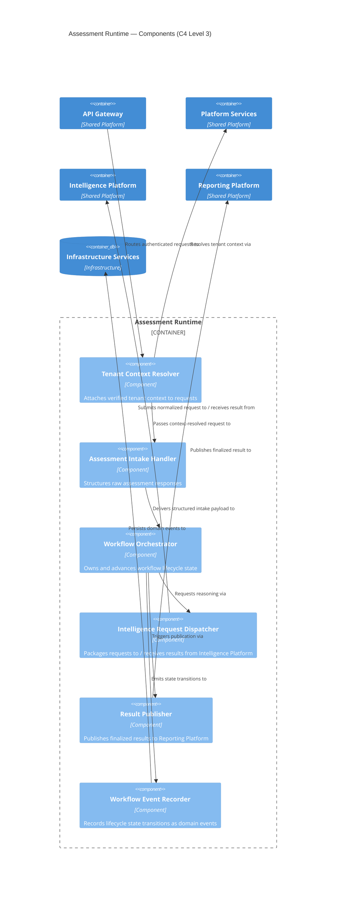
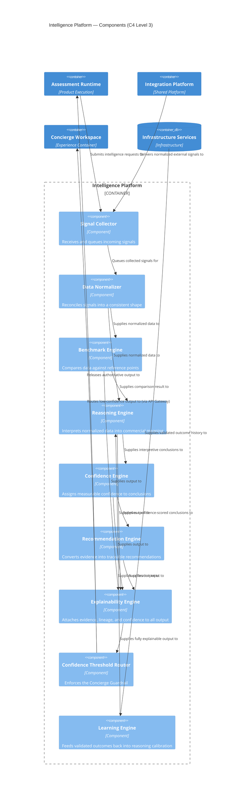
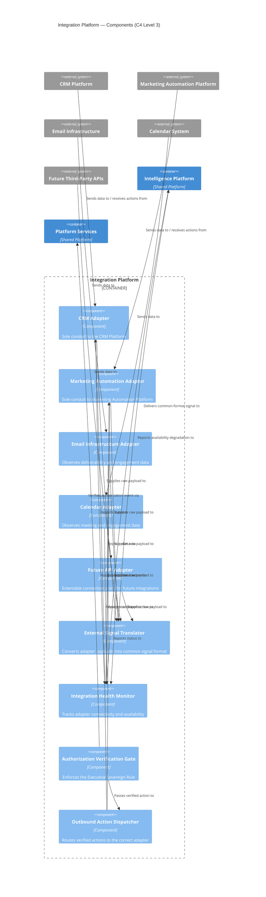
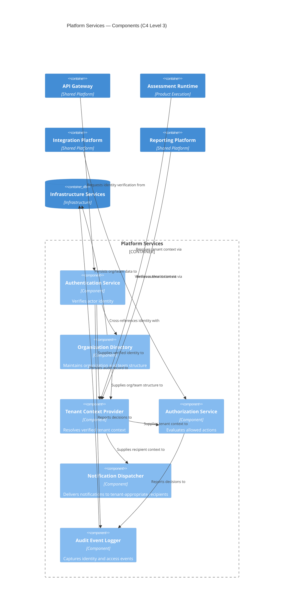
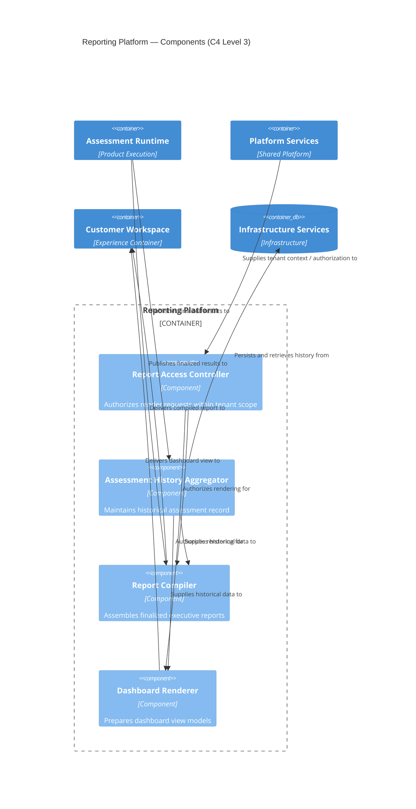

# FLUANZ — C4 Level 3: Component Architecture (Phase 1 MVP)

## Purpose

This document decomposes five approved C4 Level 2 containers into their constituent business components, for the Phase 1 MVP scope only (Assess™, on the approved container set). It does not touch Marketing Website, Customer Workspace, Concierge Workspace, or Infrastructure Services as decomposition targets — those remain Level 2 boundaries in this document, referenced only as external collaborators.

Each component below has exactly one responsibility, a defined purpose, defined inputs, defined outputs, and defined dependencies. No component performs work outside its own container's governing responsibility, per the binding rule set carried forward from C4 Level 2:

- **Assessment Runtime orchestrates.**
- **Intelligence Platform reasons.**
- **Integration Platform communicates externally.**
- **Platform Services provide shared capabilities.**
- **Reporting Platform renders intelligence.**

No component decomposed here may cross these lines. This document introduces no API contracts, no classes, and no database schemas — persistence is referenced only as "Infrastructure Services," per the Level 2 boundary.

---

# 1. Assessment Runtime — Components

**Container Responsibility (fixed by Level 2):** Orchestrates the lifecycle of assessment and, in future phases, signal-driven workflows. Performs no independent reasoning.

## 1.1 Tenant Context Resolver
- **Purpose:** Attach verified organizational and tenant context to every incoming workflow request before any orchestration begins.
- **Inputs:** Authenticated request from API Gateway (identity token, raw request).
- **Outputs:** Tenant-scoped, context-resolved request.
- **Dependencies:** Platform Services (Tenant Context Provider, Authorization Service).

## 1.2 Assessment Intake Handler
- **Purpose:** Capture and structure raw assessment responses submitted by the customer into a well-formed intake payload.
- **Inputs:** Tenant-scoped raw assessment responses.
- **Outputs:** Structured intake payload.
- **Dependencies:** Tenant Context Resolver.

## 1.3 Workflow Orchestrator
- **Purpose:** Own and advance the assessment's lifecycle state (created → intake complete → submitted for reasoning → scored → published) as the single coordinating authority for the workflow.
- **Inputs:** Structured intake payload; status updates from Intelligence Request Dispatcher.
- **Outputs:** Workflow state transitions; triggers to downstream components.
- **Dependencies:** Assessment Intake Handler, Intelligence Request Dispatcher, Workflow Event Recorder.

## 1.4 Intelligence Request Dispatcher
- **Purpose:** Package a structured intake payload into a normalized request for the Intelligence Platform and receive its explainable, confidence-scored result.
- **Inputs:** Structured intake payload (from Workflow Orchestrator).
- **Outputs:** Intelligence request (outbound to Intelligence Platform); explainable result (inbound from Intelligence Platform).
- **Dependencies:** Intelligence Platform (Signal Collector, as the container's single entry point — see Section 6, Interaction Rules).

## 1.5 Result Publisher
- **Purpose:** Publish a finalized, explainable assessment result to the Reporting Platform once the Workflow Orchestrator marks it complete.
- **Inputs:** Finalized result from Workflow Orchestrator.
- **Outputs:** Published result event (outbound to Reporting Platform).
- **Dependencies:** Reporting Platform (Report Compiler, Assessment History Aggregator).

## 1.6 Workflow Event Recorder
- **Purpose:** Record every workflow state transition as a durable domain event, satisfying Event-Driven Thinking (Engineering Principle 9).
- **Inputs:** State transition emitted by Workflow Orchestrator.
- **Outputs:** Persisted domain event.
- **Dependencies:** Infrastructure Services (event persistence, referenced only as a Level 2 container boundary).

### Assessment Runtime — Component Diagram

---

# 2. Intelligence Platform — Components

**Container Responsibility (fixed by Level 2):** The sole reasoning authority in FLUANZ. Produces confidence, evidence, lineage, and timestamp on every output. Enforces the Concierge Guardrail.

## 2.1 Signal Collector
- **Purpose:** Receive incoming signal payloads from Assessment Runtime and normalized external signals from Integration Platform, and queue them for normalization.
- **Inputs:** Intelligence requests from Assessment Runtime; normalized external signals from Integration Platform.
- **Outputs:** Collected signal set.
- **Dependencies:** Assessment Runtime, Integration Platform.

## 2.2 Data Normalizer
- **Purpose:** Reconcile all collected signals — regardless of originating source — into one consistent internal shape before reasoning occurs.
- **Inputs:** Collected signal set.
- **Outputs:** Normalized signal set.
- **Dependencies:** Signal Collector.

## 2.3 Benchmark Engine
- **Purpose:** Compare an organization's normalized signal set against relevant reference points.
- **Inputs:** Normalized signal set; reference benchmark data.
- **Outputs:** Benchmark comparison result.
- **Dependencies:** Data Normalizer; Infrastructure Services (benchmark reference data).

## 2.4 Reasoning Engine
- **Purpose:** Interpret normalized signals and benchmark comparisons into commercial meaning — the platform's core interpretive act.
- **Inputs:** Normalized signal set; benchmark comparison result.
- **Outputs:** Interpretive conclusions (readiness interpretation, prior to confidence scoring).
- **Dependencies:** Data Normalizer, Benchmark Engine.

## 2.5 Confidence Engine
- **Purpose:** Assign a measurable confidence level to each interpretive conclusion produced by the Reasoning Engine.
- **Inputs:** Interpretive conclusions.
- **Outputs:** Confidence-scored conclusions.
- **Dependencies:** Reasoning Engine.

## 2.6 Recommendation Engine
- **Purpose:** Convert confidence-scored, evidence-backed conclusions into a proposed commercial action, always traceable to its originating signal (Engineering Principle 7, Evidence Before Recommendation).
- **Inputs:** Confidence-scored conclusions.
- **Outputs:** Recommendation objects with an evidence trace.
- **Dependencies:** Confidence Engine.

## 2.7 Explainability Engine
- **Purpose:** Attach confidence, supporting evidence, data lineage, timestamp, and model version to every conclusion, benchmark result, and recommendation before it may leave the Intelligence Platform (Engineering Principle 6).
- **Inputs:** Outputs of the Reasoning Engine, Benchmark Engine, Confidence Engine, and Recommendation Engine.
- **Outputs:** Fully explainable, evidence-attached output.
- **Dependencies:** Reasoning Engine, Benchmark Engine, Confidence Engine, Recommendation Engine.

## 2.8 Confidence Threshold Router
- **Purpose:** Enforce the Concierge Guardrail by routing any explainable output whose confidence score falls below the platform-defined threshold to the Concierge Workspace before it may be treated as authoritative; all other output is released downstream.
- **Inputs:** Fully explainable output from the Explainability Engine.
- **Outputs:** Either (a) a release of the output to Assessment Runtime / Reporting Platform, or (b) a review request routed to Concierge Workspace (via API Gateway).
- **Dependencies:** Explainability Engine.

## 2.9 Learning Engine
- **Purpose:** Ingest validated outcomes — including corrections made during Concierge review — and translate them into calibration input that improves future reasoning, without altering the guardrails above.
- **Inputs:** Validated/corrected outcome events; historical event data.
- **Outputs:** Reasoning calibration input.
- **Dependencies:** Infrastructure Services (event history); Reasoning Engine (as the consumer of calibration input).

### Intelligence Platform — Component Diagram

---

# 3. Integration Platform — Components

**Container Responsibility (fixed by Level 2):** The sole conduit between FLUANZ and external systems. Enforces the Executive Sovereign Rule on all outbound action.

## 3.1 CRM Adapter
- **Purpose:** Communicate exclusively with the customer's CRM Platform — observing inbound signal data and, when authorized, carrying outbound recommended action.
- **Inputs:** CRM-originated data (inbound); authorized outbound action requests.
- **Outputs:** Raw CRM signal payloads (inbound); dispatched actions (outbound).
- **Dependencies:** Outbound Action Dispatcher, External Signal Translator.

## 3.2 Marketing Automation Adapter
- **Purpose:** Communicate exclusively with the customer's Marketing Automation Platform.
- **Inputs:** Marketing-platform-originated data; authorized outbound action requests.
- **Outputs:** Raw marketing signal payloads; dispatched actions.
- **Dependencies:** Outbound Action Dispatcher, External Signal Translator.

## 3.3 Email Infrastructure Adapter
- **Purpose:** Observe deliverability and engagement data from the customer's email infrastructure.
- **Inputs:** Email-infrastructure-originated deliverability/engagement data.
- **Outputs:** Raw email signal payloads.
- **Dependencies:** External Signal Translator.

## 3.4 Calendar Adapter
- **Purpose:** Observe meeting and engagement data from the customer's calendar system.
- **Inputs:** Calendar-originated scheduling and engagement data.
- **Outputs:** Raw calendar signal payloads.
- **Dependencies:** External Signal Translator.

## 3.5 Future API Adapter
- **Purpose:** Provide an extensible, single-responsibility connection point for future third-party data or platform APIs without requiring new container-level structure (Engineering Principle 16, Evolution Without Rewrite).
- **Inputs:** Source-specific external data (as approved integrations are added).
- **Outputs:** Raw external signal payloads.
- **Dependencies:** External Signal Translator.

## 3.6 External Signal Translator
- **Purpose:** Convert adapter-specific raw payload formats into the platform's common intermediate signal format, prior to handoff to the Intelligence Platform.
- **Inputs:** Raw payloads from any adapter.
- **Outputs:** Common-format signal, ready for Intelligence Platform ingestion.
- **Dependencies:** CRM Adapter, Marketing Automation Adapter, Email Infrastructure Adapter, Calendar Adapter, Future API Adapter.

## 3.7 Integration Health Monitor
- **Purpose:** Track the connectivity and availability of every adapter so that degraded external connectivity is reflected as reduced confidence rather than silently substituted or fabricated data (Architecture Vision, Section 8).
- **Inputs:** Adapter status signals.
- **Outputs:** Health/availability status feed.
- **Dependencies:** All adapters.

## 3.8 Authorization Verification Gate
- **Purpose:** Verify that any outbound action request carries a valid, human-originated authorization event before it may be dispatched — the component-level enforcement point of the Executive Sovereign Rule.
- **Inputs:** Outbound action request; authorization event reference.
- **Outputs:** Verified (allow) or rejected (deny) decision.
- **Dependencies:** Platform Services (Authorization Service).

## 3.9 Outbound Action Dispatcher
- **Purpose:** Route a verified, authorized outbound action to the correct adapter for execution against the target external system.
- **Inputs:** Verified outbound action (from Authorization Verification Gate).
- **Outputs:** Action assigned to the correct adapter.
- **Dependencies:** Authorization Verification Gate; CRM Adapter; Marketing Automation Adapter.

### Integration Platform — Component Diagram

---

# 4. Platform Services — Components

**Container Responsibility (fixed by Level 2):** Provide shared identity, authorization, tenancy, and notification capability consumed by every other container.

## 4.1 Authentication Service
- **Purpose:** Verify the identity credentials of any actor (Executive Revenue Leader, Operational Revenue User, Concierge Expert) attempting to access FLUANZ.
- **Inputs:** Credential or session token.
- **Outputs:** Authenticated identity assertion.
- **Dependencies:** Infrastructure Services (identity record persistence).

## 4.2 Organization Directory
- **Purpose:** Maintain the structural record of organizations and teams — the tenancy boundary itself (Engineering Principle 5).
- **Inputs:** Organization/team management requests.
- **Outputs:** Resolved organization and team structure.
- **Dependencies:** Infrastructure Services.

## 4.3 Tenant Context Provider
- **Purpose:** Resolve and package a verified tenant context object for consumption by any requesting container, combining identity with organizational structure.
- **Inputs:** Authenticated identity assertion; organization/team lookup.
- **Outputs:** Resolved tenant context object.
- **Dependencies:** Authentication Service, Organization Directory.

## 4.4 Authorization Service
- **Purpose:** Evaluate whether an authenticated, tenant-scoped identity may perform a specific requested action, enforcing least-privilege access (Engineering Principle 11).
- **Inputs:** Tenant context object; requested action.
- **Outputs:** Allow/deny decision.
- **Dependencies:** Tenant Context Provider.

## 4.5 Notification Dispatcher
- **Purpose:** Deliver notifications — email, in-app alerts, scheduled report triggers — to the correct, tenant-appropriate recipient.
- **Inputs:** Notification request (type, recipient reference, content reference).
- **Outputs:** Dispatched notification.
- **Dependencies:** Tenant Context Provider.

## 4.6 Audit Event Logger
- **Purpose:** Capture every authentication and authorization decision as a durable audit record, satisfying audit logging requirements (Engineering Principle 11) and Event-Driven Thinking (Principle 9).
- **Inputs:** Authentication and authorization decisions.
- **Outputs:** Persisted audit record.
- **Dependencies:** Authentication Service, Authorization Service, Infrastructure Services.

### Platform Services — Component Diagram

---

# 5. Reporting Platform — Components

**Container Responsibility (fixed by Level 2):** Render finalized intelligence into executive-facing reports and dashboards. Generates no intelligence of its own.

## 5.1 Report Access Controller
- **Purpose:** Ensure that any request to render a report or dashboard is authorized within the requesting actor's own tenant scope before any rendering occurs.
- **Inputs:** Render request; tenant context.
- **Outputs:** Authorized (or denied) render permission.
- **Dependencies:** Platform Services (Tenant Context Provider, Authorization Service).

## 5.2 Assessment History Aggregator
- **Purpose:** Maintain and retrieve an organization's historical record of completed assessments and results, for trend and history display.
- **Inputs:** Completed assessment result events (from Assessment Runtime's Result Publisher).
- **Outputs:** Aggregated historical data set.
- **Dependencies:** Infrastructure Services (event/history persistence).

## 5.3 Report Compiler
- **Purpose:** Assemble a finalized, explainable executive report (e.g., PDF) from a completed assessment result, preserving its attached evidence and confidence data exactly as produced by the Intelligence Platform.
- **Inputs:** Finalized, explainable assessment result.
- **Outputs:** Compiled report artifact.
- **Dependencies:** Report Access Controller, Assessment History Aggregator.

## 5.4 Dashboard Renderer
- **Purpose:** Prepare an executive dashboard view of current and historical readiness intelligence for presentation in the Customer Workspace.
- **Inputs:** Current finalized result; aggregated historical data.
- **Outputs:** Dashboard-ready view model.
- **Dependencies:** Report Access Controller, Assessment History Aggregator.

### Reporting Platform — Component Diagram

---

# 6. Interaction Rules

These rules bind component interaction both within and across the five containers in scope. They are a component-level refinement of the C4 Level 2 Interaction Rules — they narrow, but never override, that document.

1. **Only one component per container may cross a container boundary in each direction**, preserving Level 2's container-level contract:
   - Assessment Runtime's *Intelligence Request Dispatcher* is the only component permitted to call into the Intelligence Platform.
   - Assessment Runtime's *Tenant Context Resolver* is the only component permitted to call into Platform Services for context resolution.
   - Assessment Runtime's *Result Publisher* is the only component permitted to call into the Reporting Platform.
   - Integration Platform's *External Signal Translator* is the only component permitted to deliver signals into the Intelligence Platform.
   - Integration Platform's *Authorization Verification Gate* is the only component permitted to call into Platform Services.
   - Reporting Platform's *Report Access Controller* is the only component permitted to call into Platform Services for tenant/authorization context.
2. **No component in the Intelligence Platform may bypass the Explainability Engine.** Every path from Reasoning Engine, Benchmark Engine, Confidence Engine, or Recommendation Engine to any consumer outside the container passes through the Explainability Engine and then the Confidence Threshold Router — with no exception.
3. **The Confidence Threshold Router is the only component authorized to route output to the Concierge Workspace.** No other Intelligence Platform component may address Concierge Workspace directly, preserving the Concierge Guardrail as a single, auditable enforcement point.
4. **The Authorization Verification Gate is the only component authorized to approve dispatch through the Outbound Action Dispatcher.** No adapter may act on an outbound action that has not passed through this gate, preserving the Executive Sovereign Rule as a single, auditable enforcement point.
5. **Adapters do not communicate with each other.** Each of the five Integration Platform adapters (CRM, Marketing Automation, Email Infrastructure, Calendar, Future API) is isolated to its own external system; cross-adapter coordination, if ever required, occurs only through the External Signal Translator or Outbound Action Dispatcher.
6. **Report Compiler and Dashboard Renderer never receive unfinalized or unexplained intelligence.** Both components consume only results that have already passed through the Intelligence Platform's Confidence Threshold Router.
7. **No component in Reporting Platform computes a score, confidence value, or recommendation.** Reporting Platform components render and aggregate only.
8. **The Learning Engine never modifies the Confidence Threshold Router's threshold logic.** Learning feeds calibration into the Reasoning Engine only, ensuring the Concierge Guardrail's enforcement point remains stable and human-governed rather than self-modifying.
9. **Every component that resolves tenant context does so through Platform Services' Tenant Context Provider** — no component maintains a private notion of tenant scope.

---

# 7. Alignment Verification

| Governing Document | Alignment Point |
|---|---|
| Founder Bible — Sovereign Advisory / Concierge Guardrail | Enforced structurally by the Authorization Verification Gate (Integration Platform) and the Confidence Threshold Router (Intelligence Platform), each a single, dedicated component — not a convention. |
| Founder Bible — Absolute Explainability | Enforced by the Explainability Engine, which every Intelligence Platform output must pass through before leaving the container. |
| Engineering Principle 2 — Single Source of Commercial Truth | Only the Intelligence Platform's Reasoning, Benchmark, Confidence, and Recommendation Engines compute commercial conclusions; no other container or component in scope duplicates this logic. |
| Engineering Principle 5 — Organization Isolation | Enforced by the Tenant Context Provider and consumed uniformly by Tenant Context Resolver, Authorization Verification Gate, and Report Access Controller. |
| Engineering Principle 6 — Explainable Intelligence | Explainability Engine attaches confidence, evidence, lineage, and timestamp before any output is released. |
| Engineering Principle 7 — Evidence Before Recommendation | Recommendation Engine consumes only Confidence Engine output, which itself descends from Reasoning and Benchmark Engine output — an unbroken evidence chain. |
| Engineering Principle 8 — Human Authority | Confidence Threshold Router and Authorization Verification Gate are the structural seats of human authority within their containers. |
| Engineering Principle 9 — Event-Driven Thinking | Workflow Event Recorder and Audit Event Logger produce durable domain events for all significant actions in scope. |
| Engineering Principle 16 — Evolution Without Rewrite | Future API Adapter and the extensible design of Workflow Orchestrator allow new signal sources and future product-family workflows without structural rework. |
| Engineering Principle 18 — AI is a Platform Capability | All nine Intelligence Platform components are consumed identically by Assessment Runtime today and by any future product-execution container, with no reasoning logic permitted elsewhere. |
| Architecture Vision, Section 8 — Integration Philosophy | Integration Health Monitor ensures degraded external connectivity is reflected as reduced confidence, never fabricated data. |
| C4 Level 2 Governing Verbs | Every component in this document maps to exactly one of "orchestrates," "reasons," "communicates externally," "provides shared capability," or "renders" — none crosses into another container's verb. |

---

# Closing Statement

This Component Model completes the Phase 1 MVP decomposition of Assessment Runtime, Intelligence Platform, Integration Platform, Platform Services, and Reporting Platform without altering a single container boundary established at Level 2. Every component carries one responsibility, a defined input, a defined output, and an explicit dependency set. The Concierge Guardrail and Executive Sovereign Rule are each enforced by exactly one dedicated, auditable component — the Confidence Threshold Router and the Authorization Verification Gate, respectively — rather than being distributed as an implicit convention across the system.

This document is the fixed reference point for any subsequent implementation planning; no downstream engineering work may introduce a component, dependency, or cross-container call that this document does not describe without a formal Architecture Decision Record, per Engineering Principle 1.